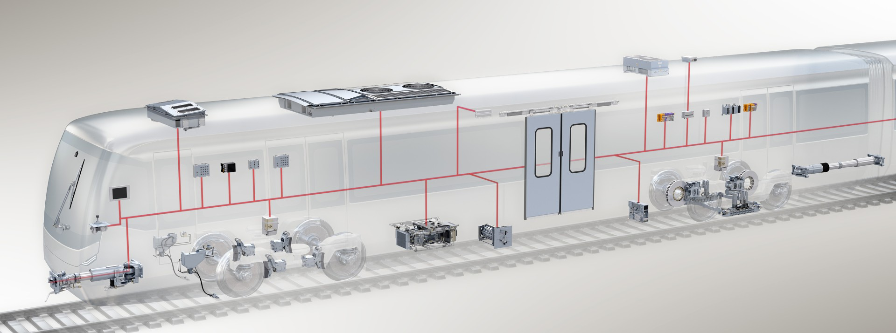

# 🚇 SmartRail APU Insights: An Industry 4.0 Perspective

## 📌 Project Overview

Hi, I'm Subrat Kumar Dang, and this repository contains my personal project aimed at building a **predictive analytics system** for metro train compressors using the **MetroPT-3 dataset**.



Through this project, I plan to explore advanced data analysis- statistical and visualization, anomaly detection techniques, and predictive modeling to proactively monitor the Air Production Unit (APU) compressor system and reduce unplanned downtimes. This work is part of my broader goal of contributing AI-driven solutions for smart transportation and industrial applications.


## 📂 Dataset Description

The dataset consists of **over 15 million data points** collected at 1Hz frequency from February to August 2020. It includes **15 features** from a mix of **7 analog** and **8 digital** sensors installed in the metro compressor system.

### 🔧 Key Features:

* `TP2 (bar)`: Pressure on the compressor
* `TP3 (bar)`: Pressure at the pneumatic panel
* `H1 (bar)`: Pressure from cyclonic separator filter discharge
* `DV pressure (bar)`: Pressure drop in air dryers
* `Reservoirs (bar)`: Downstream pressure of reservoirs
* `Motor Current (A)`: Current in a phase of the three-phase motor
* `Oil Temperature (ºC)`: Compressor oil temperature
* `COMP`: Electrical signal of air intake valve
* `DV electric`: Compressor outlet valve control
* `TOWERS`: Active drying tower indicator
* `MPG`: Starts compressor under load
* `LPS`: Activates under pressure <7 bar
* `Pressure Switch`: Detects air-dryer discharge
* `Oil Level`: Detects low oil level
* `Caudal Impulse`: Air flow to reservoirs


## 🧱 Project Structure

```
metropt3-predictive-maintenance/
│
├── data/
│   ├── raw/                    # Original data
│   ├── processed/              # Cleaned and transformed data
│   └── interim/                # Intermediate transformation results
│
├── notebooks/
│   ├── 01_Data_Exploration.ipynb
│   ├── 02_Statistical_Analysis.ipynb
│   ├── 03_Feature_Engineering.ipynb
│   ├── 04_Anomaly_Detection.ipynb
│   └── 05_Predictive_Maintenance.ipynb
│
├── src/
│   ├── data_processing.py
│   ├── visualization.py
│   ├── feature_engineering.py
│   ├── anomaly_detection.py
│   └── predictive_models.py
│
├── models/                     # Saved models
├── reports/
│   ├── figures/
│   └── statistical_analysis.md
│
├── requirements.txt
├── LICENSE
└── README.md
```


## 🔍 My Plan of Action

### 1. 📊 Data Visualization

* Sensor-wise time series trends
* Correlation and heatmaps
* Distribution plots & boxplots
* Interactive dashboards for monitoring
* Trend analysis for pressure, current, and temperature

### 2. 📈 Statistical Analysis

* Descriptive stats and variability
* Stationarity checks (ADF, KPSS)
* Trend and seasonality decomposition
* PCA for dimensionality reduction
* Hypothesis testing between normal vs faulty behavior

### 3. 🧹 Data Preprocessing

* Missing value handling
* Timestamp resampling and alignment
* Outlier detection and treatment
* Normalization & signal encoding
* Creation of time-based features

### 4. 🛠️ Feature Engineering

* Rolling metrics (mean, std, min, max)
* Rate of change and time-based features
* Motor and valve state transitions
* Fourier transforms for signal analysis
* Compressor cycle segmentation

### 5. 🚨 Anomaly Detection

* Isolation Forest & One-Class SVM
* Deep Autoencoders
* LSTM-based temporal anomalies
* Ensemble and statistical methods
* Explainable AI techniques (e.g., SHAP for anomalies)

### 6. 🔮 Predictive Modeling

* Binary classification of failures
* Remaining Useful Life (RUL) prediction
* Survival analysis
* Forecasting using LSTM
* Gradient Boosting and Random Forest
* Model evaluation with time-series CV

### 7. 📡 Digital Monitoring & Deployment

* Real-time API for predictions
* Dashboards to monitor compressor health
* Alert systems for anomalies
* Digital twin design
* Maintenance recommendation engine
* Periodic model retraining pipeline


## ⚙️ Tech Stack & Requirements

* **Python 3.8+**
* Core Libraries: `pandas`, `numpy`, `matplotlib`, `seaborn`, `scikit-learn`, `tensorflow`/`pytorch`, `xgboost`, `lightgbm`, `plotly`


## 🚀 Getting Started

### 1. Clone the repository

```bash
git clone 
cd metropt3-predictive-maintenance
```

### 2. Set up a virtual environment

```bash
python -m venv venv
source venv/bin/activate  # For Windows: venv\Scripts\activate
```

### 3. Install dependencies


## 🎯 Expected Outcomes

* Identification of critical failure indicators
* Early warning system to avoid breakdowns
* Intelligent maintenance scheduling
* Reliable monitoring of compressor health
* Reduction in unplanned service outages


